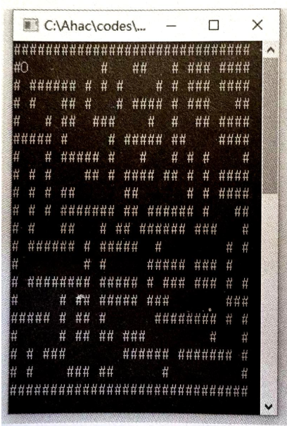

# CPL-2024

JLU CPL experiments

### 实验一：魔术师猜数

在一种室内互动游戏中，魔术师要每位观众心里想一个三位数 abc（a、b、c 分别是百位、十位和个位数字），然后魔术师让观众心中记下 acb、bac、bca、cab、cba 五个数以及这 5 个数的和值。只要观众说出这个和是多少，则魔术师一定能猜出观众心里想的原数 abc 是多少。例如，观众甲说他计算的和值是 1999，则魔术师立即说出他想的数是 443，而观众乙说他计算的和值是 1998，则魔术师说：“你算错了！”。请编程模拟这个数字魔术游戏！

我的[**魔术师猜数字实验**](./public/docs/Guess_number.md)

### 实验三：走迷宫

通过键盘上的 “W”、“S”、“A”、“D” 四个按键来控制 1 个“小球”向上、下、左、右移动，目的就是让这个“小球”从起点走出迷宫。先来看看这个迷宫的实例吧！用字符#表示栅栏，用大写字母 O 表示小球。



提示：可以用二维字符数组来存储一个迷宫；可以进行游戏拓展，游戏可以分为多种模式，图中仅为一个示例；可以先从一个简单的迷宫做起！

```c
// 二维数组示例
char a[50][50]={"######", 
                "#O # ", 
                "# ## #", 
                "# # #", 
                "###", 
                "######"};
```

我的[**走迷宫实验**](./public/docs/Go_maze.md)

### 使用说明

```bash
git clone git@github.com:stuPETER12138/CPL-2024.git
cd CPL-2024
mkdir build
cd build
cmake ..
make
```
### TODO

- [ ] /docs/Guess_number.md
- [ ] /docs/Go_maze.md
